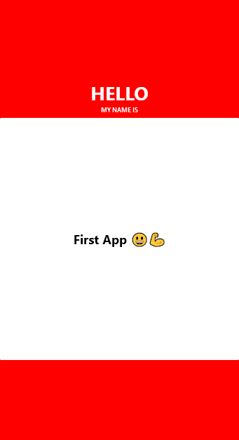

# React Native First App
[back to root react-native-apps](https://github.com/sadref/react-native-apps/tree/main)

This is a simple React Native app that demonstrates the basic usage of React Native components and Expo APIs. It displays a "Hello, My name is First App 😃💪" message on a red background in landscape mode.

## Getting Started

[Expo snack link](https://snack.expo.dev/@sadref/github.com-sadref-react-native-apps:first-app?platform=web)

## Screenshots



### Prerequisites

Before you start, ensure you have the following prerequisites installed on your development machine:

- Node.js and npm (Node Package Manager): [Download and Install Node.js](https://nodejs.org/)
- Expo CLI (for React Native development): Install globally using npm.

  ```bash
  npm install -g expo-cli

## Installation

1. Clone this repository to your local machine:

```bash
  git clone https://github.com/sadref/react-native-apps.git
```
2. Navigate to the project directory:

```bash
  cd react-native-apps/first-app
```
3. Instal project dependencies:

```bash
 npm install
```

4. Start the Expo development server:

```bash
 npx expo start
```
5. Use the Expo Go app on your mobile device (iOS or Android) to scan the QR code displayed in the terminal. This will open the app on your device.