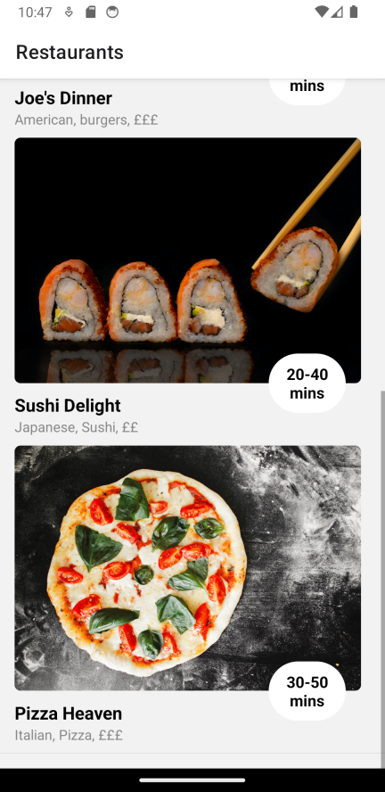
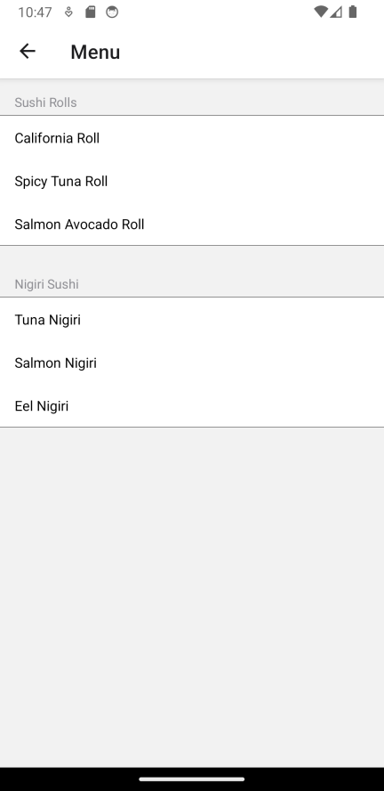

# Restaurant App
[back to root react-native-apps](https://github.com/sadref/react-native-apps)

A simple React Native app for browsing restaurant menus.

## Description

This app allows users to view a list of restaurants, each with its menu items. Users can select a restaurant to view its menu and menu items.

## Components Used

This app uses the following React Native components and libraries:

* **react-native-tableview-simple**: Used for creating tables to display restaurant details and menus.
   - GitHub Repository: [https://github.com/Purii/react-native-tableview-simple](https://github.com/Purii/react-native-tableview-simple)

* **@react-navigation/native**: Used for navigation between different screens in the app.
   - GitHub Repository: [https://github.com/react-navigation/react-navigation](https://github.com/react-navigation/react-navigation)

* **createNativeStackNavigator**: A navigation stack for React Navigation.
   - GitHub Repository: [https://github.com/react-navigation/createNativeStackNavigator](https://github.com/react-navigation/createNativeStackNavigator)

## Screenshots




## Getting Started

 [Expo snack link](https://snack.expo.dev/@sadref/food-app?platform=web)

### Prerequisites

Before you start, ensure you have the following prerequisites installed on your development machine:

- Node.js and npm (Node Package Manager): [Download and Install Node.js](https://nodejs.org/)
- Expo CLI (for React Native development): Install globally using npm.

  ```bash
  npm install -g expo-cli
## Installation

1. Clone this repository to your local machine:

```bash
  git clone https://github.com/sadref/react-native-apps.git
```
2. Navigate to the project directory:

```bash
  cd react-native-apps/food-app
```
3. Instal project dependencies:

```bash
 npm install
```

4. Start the Expo development server:

```bash
 npx expo start
```

[back to root react-native-apps](https://github.com/sadref/react-native-apps)