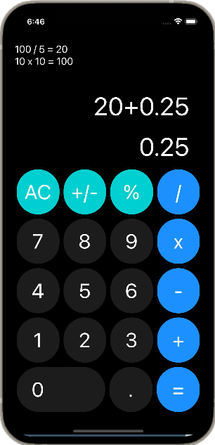
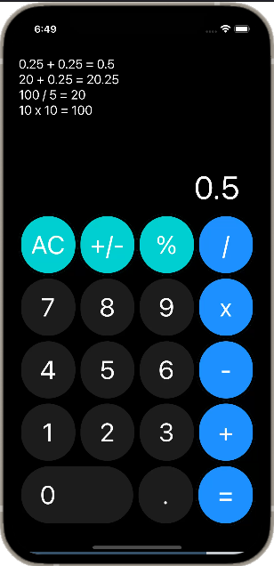

# Functional Calculator App

Welcome to the Functional Calculator App repository! This React Native calculator app allows you to perform basic arithmetic calculations on your mobile device.

## Table of Contents
- [Introduction](#introduction)
- [Features](#features)
- [Screenshots](#screenshots)
- [Getting Started](#getting-started)
  - [Prerequisites](#prerequisites)
  - [Installation](#installation)
- [Usage](#usage)
- [Installation](#Installation)
- [Expo snack link](https://snack.expo.dev/@sadref/functional-calculator-final?platform=web)

## Introduction

This calculator app is built using React Native and provides a user-friendly interface for performing mathematical operations. Whether you need to add, subtract, multiply, divide, or calculate percentages, this app has you covered. It also features a history of your calculations for reference.

## Features

- Basic arithmetic operations: addition, subtraction, multiplication, and division.
- Percentage calculation.
- Change the sign of the current number (+/-).
- Clear the calculation history.
- User-friendly and intuitive interface.

## Screenshots




## Getting Started

 [Expo snack link](https://snack.expo.dev/@sadref/functional-calculator-final?platform=web)

### Prerequisites

Before you start, ensure you have the following prerequisites installed on your development machine:

- Node.js and npm (Node Package Manager): [Download and Install Node.js](https://nodejs.org/)
- Expo CLI (for React Native development): Install globally using npm.

  ```bash
  npm install -g expo-cli
## Installation

1. Clone this repository to your local machine:

```bash
  git clone https://github.com/sadref/react-native-apps.git
```
2. Navigate to the project directory:

```bash
  cd react-native-apps/functional-calculator
```
3. Instal project dependencies:

```bash
 npm install
```

4. Start the Expo development server:

```bash
 npx expo start
```

5. Use the Expo Go app on your mobile device (iOS or Android) to scan the QR code displayed in the terminal. This will open the app on your device.
## Usage/Examples

- Launch the app on your mobile device.
- Use the buttons to input numbers and perform calculations.
- Arithmetic operations: +, -, x (multiply), / (divide).
- Change the sign of the current number: +/-.
- Calculate percentages: %.
- Clear the calculation history by long-pressing the "AC" button.
- View your calculation history at the top of the app.
- Press the "=" button to see the result of your calculation.
