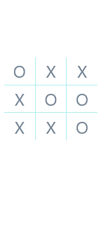

# React Native UI Design (tic tac toe example)
[back to root react-native-apps](https://github.com/sadref/react-native-apps)

This is a simple React Native app that demonstrates a user interface (UI) design. It displays a 3x3 grid with some cells containing 'O' or 'X' symbols, showcasing a UI design concept.


## Features

- Simple and clean UI design.
- Responsive 3x3 grid layout.
- Demonstrates the use of React Native's `FlatList` and `SafeAreaView` components.
- Uses various styling techniques to create a visually appealing interface.

## Getting Started

[Expo snack link](https://snack.expo.dev/@sadref/github.com-sadref-react-native-apps:tic-tac-toe-ui?platform=web)

## Screenshots



### Prerequisites

Before you start, ensure you have the following prerequisites installed on your development machine:

- Node.js and npm (Node Package Manager): [Download and Install Node.js](https://nodejs.org/)
- Expo CLI (for React Native development): Install globally using npm.

  ```bash
  npm install -g expo-cli

## Installation

1. Clone this repository to your local machine:

```bash
  git clone https://github.com/sadref/react-native-apps.git
```
2. Navigate to the project directory:

```bash
  cd react-native-apps/tic-tac-toe-ui
```
3. Instal project dependencies:

```bash
 npm install
```

4. Start the Expo development server:

```bash
 npx expo start
```
5. Use the Expo Go app on your mobile device (iOS or Android) to scan the QR code displayed in the terminal. This will open the app on your device.

[back to root react-native-apps](https://github.com/sadref/react-native-apps)
